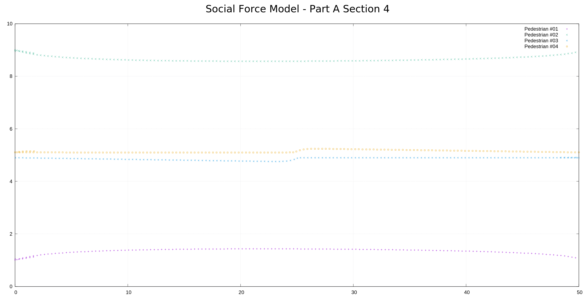
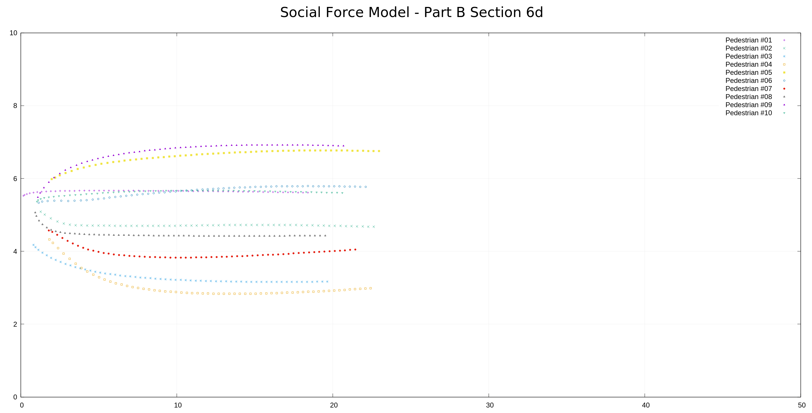
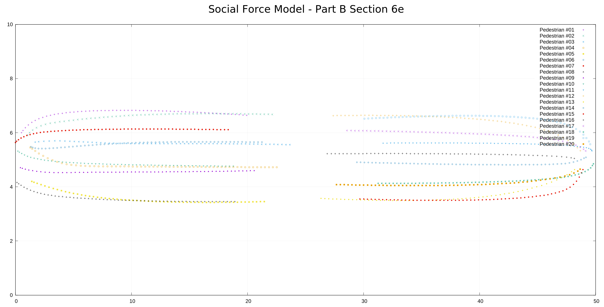

# PHAS0100Assignment2

**Coursework 2 by John Duffy for PHAS0100 Research Computing with C++ 2019/2020.**

## Description

This coursework provides command line applications to implement Social Force Model for Pedestrian Dynamics (Helbing & Molnar).

The names of the applications match the coursework instructions as follows:

* sfmPartASection4App
* sfmPartASection5App
* sfmPartBSection6dApp
* sfmPartBSection6eApp
* sfmPartBSection7aApp
* sfmPartBSection7b1App
* sfmPartBSection7b2App
* sfmPartBSection7b3App

Details on how to use these programs and sample output is provided below. The output from these programs is provided as PNG visualised data or Linux terminal screenshots.

Gnuplot scripts are used to produce the PNG images. The images can be easily viewed from the command line using the Eye of GNOME (eog) command, or a similar image viewer. Details on how to install Gnuplot and eog, and how to use the provided Gnuplot scripts, are also provided below.

## Differences from Coursework Instructions

### Use of sfmTypes instead of sfmBasicTypes

During early development an issue with sfmBasicTypes (provided with the suggested coursework template) was identified. Specifically, because all of the methods of sfmBasicTypes use reference parameters, it was not possible to chain operations together, or use compound statements, using the provided vec2d, pos2d and dir2d types. This issue was susequently rectified, but in the meantime I decided to implement my own functionality as sfmTypes.

sfmTypes provides two classes, Pos2d and Vec2d. Pos2d is used for 2D positions defined by x and y values. Vec2d is used for all 2D vector quantities (e.g. velocity, accelleration, direction) defined by x and y lengths.

sfmTypes methods only support call-by-value parameters. This is a design decision which enables simple chained/compound use.

For clarity and simplicity, sfmTypes only implements the bare minium of operator/methods required.

sfmTypes provides the wrapping functionality of sfmBasicTypes, but enables Pos2d object instantiation at "world boundaries" without immediate wrapping. This removes the restriction of having to set a destination position slightly less than a "world boundary". The wrapping functionality utilises a recursive method, sfmTypes::Wrap. Full unit testing of sfmTypes is provided.

### Pedestrian Border Repulsive Force

The coursework instructions state that only the closest border should be considered when determining the Pedestrian-Border repulsive force, whereas the Helbing and Molnar paper sums all Pedestrian-Border forces.

I made the design decision to sum the top and bottom corridor Pedestrian-Border forces. The reason for this decision is that it is more aligned with the Helbing and Molnar paper, and also cleaner to implement as no test for the closest border is required.

### Use of Gnuplot instead of sfm::Visualiser

Due to time pressure to complete this coursework (due to other pressing coursework deadlines!) and prior to the availability of sfm::Visualiser, I implemented output data visualisation using Gnuplot. This visualisation tool has been used for my final submission after confirmation from Jim (by email) that no marks will be lost for doing so.

## Installation and Build Instructions

This assignment has been submitted as a zip file as required by the assignment instructions.

To install from the zip file:
```
unzip 19154676.zip
cd 19154676
mkdir PHAS0100Assignment2-Build
cd PHAS0100Assignment2-Build
cmake ../PHAS0100Assignment2
make
```
To run the tests (with verbose output):
```
ctest -V
```
The executable applications will be in the PHAS0100Assignment2-Build/bin directory.

Additionally, this assignment can be built from a private GitHub respository. The repository is private to prevent plagiarism, again, as required by the assignment instructions. To obtain the username and password for this repository please contact [John Duffy](mailto:john.duffy.19@ucl.ac.uk). To build from this repository:
```
git clone https://github.com/johnduffymsc/PHAS0100Assignment2.git
mkdir PHAS0100Assignment2-Build
cd PHAS0100Assignment2-Build
cmake ../PHAS0100Assignment2
make
```
To run the tests (with verbose output):
```
ctest -V
```
The executable applications will be in the PHAS0100Assignment2-Build/bin directory.

To install Gnuplot (on Ubuntu 18.04):
```
sudo apt install gnuplot
```
To install Eye of GNOME (on Ubuntu 18.04):
```
sudo apt install eog
```
## Useage

### Application sfmPartASection4App

This application generates output data for the dynamics of 4 pedestrians moving in a corridor under the influence of the Pedestrian-Destination, Pedestrian-Border (top and bottom corridor borders) and Pedestrian-Pedestrian forces.

The corridor is of dimensions x in the interval [0, 50] and y in the interval [0, 10].

Pedestrian #1 starts at the (x, y) position (0, 1), heading in the positive x direction, targeting the opposite corridor position (50, 1).

Pedestrian #2 starts at the (x, y) position (0, 9), heading in the positive x direction, targeting the opposite corridor position (50, 9).

Pedestrian #3 starts at the (x, y) position (50, 4.9), heading in the negative x direction, targeting the opposite corridor position (0, 4.9).

Pedestrian #4 starts at the (x, y) position (0, 5.1), heading in the positive x direction, targeting the opposite corridor position (50, 5.1).

The application is run, using a time step of 0.25s and a run time of 40s, as follows:
```
cd PHAS0100Assignment2-Build
bin/sfmPartASection4App > sfmPartASection4App.data
```
The sfmPartASection4App.data file will be in the PHAS0100Assignment2-Build directory.

To visualise this data file using the provided Gnuplot scripts type the Gnuplot command:
```
gnuplot
```
At the Gnuplot prompt:
```
gnuplot> load "../PHAS0100Assignment2/Gnuplot/sfmPartASection4App.gnuplot"
```
This will open up an image window from where the plot can be saved as a PNG image (or PDF, or other image format).

Then type 'q' to close the image window. Then press 'q' again at the Gnuplot prompt to exit Gnuplot.

A sample PNG image with description is provided below.



As can be seen from the plot, Pedestrian #1 starts to move in the positive x direction under the influence of the Pedestrian-Destination force. An accelleration under this force is evident in the first few timesteps. At the same time the pedestrian is repelled from the bottom border by the Pedestrian-Border force (and also repelled from the top border but by a much weaker force), so the pedestrian does not travel in a straight line. The pedestrian travels in a curve which is the equillibrium path between all of the forces. Due to the distance from other pedestrians there is no discernible "avoiding action". As the pedestrian approaches the destination the Pedestrian-Destination force dominates and the pedestrian reaches the destination, and then wraps off the "end off the world" back to the starting point. This wrap is evident in the pedestrian path.

Pedestrian #2 moves in similar manner in proximity to the top border.

Pedestrians #3 and #4 start at opposite ends of the corridor moving towards each other. Because they are moving in the centre of the corridor there is no discernible Pedestrian-Border force acting upon them so they move, initially, in an approximate straight line. However, as they approach each other they both take "avoiding action" under the Pedestrian-Pedestrian force, before continuing towards their respective destinations. They reach their respective destinations and wrap off the "end of the world" back to their starting points. The wrap is evident in their paths.

### Application sfmPartASection5App

This application generates output data for the dynamics of 20 pedestrians moving in a corridor under the influence of the Pedestrian-Destination, Pedestrian-Border (top and bottom corridor borders) and Pedestrian-Pedestrian forces.

10 pedestrians start at x = 0 with random y intervals, moving in a positive x direction, targeting x = 50 with random y intervals.

10 pedestrians start at x = 50 with random y intervals, moving in a negative x direction, targeting x = 0 with random y intervals.

The application is run, using a time step of 0.25s and a run time of 40s, as follows:
```
cd PHAS0100Assignment2-Build
bin/sfmPartASection5App > sfmPartASection5App.data
```
Th sfmPartASection5App.data file will be in the PHAS0100Assignment2-Build directory.

The data file can be visualised in a similar manner as described in the section above.

A sample PNG image with description is provided below.


As can be seen from the plot, the pedestrians move under the influence of all of the forces, but "avoiding action" is more evident.

It is important to note that where tradjectories cross, this occurs at different times for each pedestrian, so the pedestrians do not actual collide.

Wrapping off the "end of the world" is evident in the pedestrian tradjectories.

### Application sfmPartBSection6dApp

This application generates output data for the dynamics of 10 Targeted pedestrians moving in a corridor under the influence of the Pedestrian-Destination, Pedestrian-Border (top and bottom corridor borders) and Pedestrian-Pedestrian forces.

The 10 pedestrians are generated at random starting points in a box x = [0, 2] and y = [4, 6], moving in a positive x direction, targeting the mid-point of the opposite wall.

The application is run and visualised in a similar manner as previously described.

A sample PNG image with description is provided below for a timestep of 0.25s and a run time of 15s.



As can be seen from the plot, the force that dominates initially is the Pedestrian-Pedestrian repulsive force which causes the pedestrians to move away from each other, before settling on to relatively stable tradjectories towards the target. 

### Application sfmPartBSection6eApp

This application generates output data for the dynamics of 10 Targeted pedestrians and 10 Directional pedestrians moving in a corridor under the influence of the Pedestrian-Destination, Pedestrian-Border (top and bottom corridor borders) and Pedestrian-Pedestrian forces.

The 10 Targeted pedestrians are generated at random starting points in a box x = [0, 2] and y = [4, 6], moving in a positive x direction, targeting the mid-point of the opposite wall.

The 10 Directional pedestrians are generated at random starting points in a box x = [48, 50] and y = [4, 6], moving in a negative x direction.

The application is run and visualised in a similar manner as previously described.

A sample PNG image with description is provided below for a timestep of 0.25s and a run time of 15s.



As can be seen from the plot, the force that dominates initially is the Pedestrian-Pedestrian repulsive force which causes the pedestrians to move away from each other, before settling on to relatively stable tradjectories.

### Application sfmPartBSection7aApp

This application demonstrates benchmarking using std::chrono::high_resolution_clock and std::clock.

A Linux terminal screenshot of how to run the application and the output is provided below.


As can be seen from the application output, because this is a single threaded application, the CPU and Wall timings are nearly identical.

However, of note is that there is significant "jitter" between the 4 runs of the application, with a minimum time of  47.7ms and a maximum of 51.3ms. This is to be expected since the operating system will be allocating resources and other processes differently on each occasssion (and we are running in a virtualised environment).

To get a better average application run time a 'bash' loop was used to run the application 1000 times. This resulted in an average run time of 39.5ms (39.5s / 1000).

### Application sfmPartBSection7b1App

This application demonstrates the use of OpenMP to parallelise code to improve performance. sfmPartBSection7b1App uses a single "#pragma omp parallel for" loop.

A Linux terminal screenshot of how to run the application, using different numbers of threads, and the output is provided below.


To avoid "jitter" a 'bash' loop was used to run the application 1000 times.

As can been seen from the results, single threaded 7a took an average of 38.4ms, while 7b1 took 47.4ms, 34.1ms, 28.4ms and 26.7ms, for 1, 2, 3 and 4 threads, respectively.

From these timings it can be determined that there is an overhead is using OpenMP, but when the number of threads is increased the run time can be reduced compared to the single threaded case.

Using 4 threads produced a 30% time saving. This is certaining not a linear reduction in time with number of threads. However, the use of OpenMP in this appllication is relatively naiive, and this application is data output intensive which may be difficult to parallelise effectively without each thread writing to a different file.

### Application sfmPartBSection7b2App


### Application sfmPartBSection7b3pp


